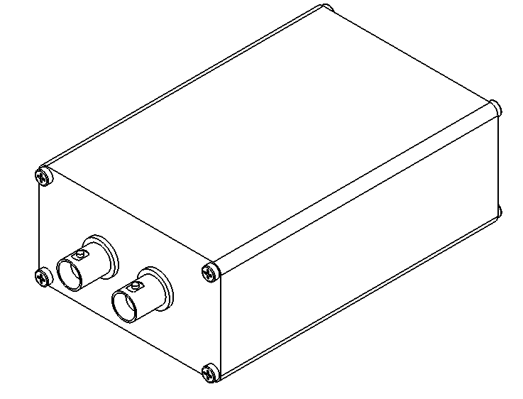
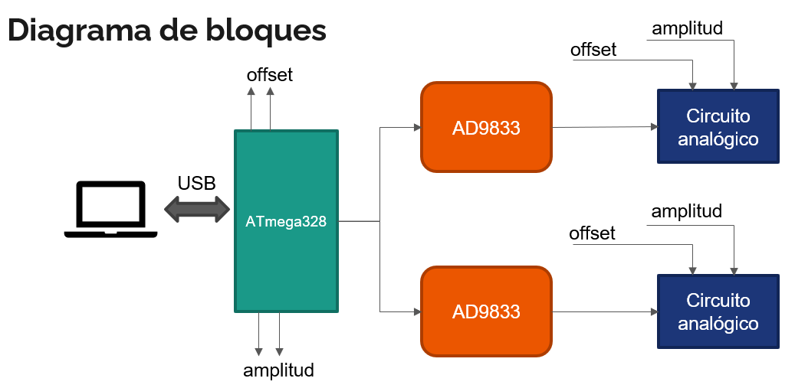

# Generador DDS programable
Este generador es un instrumento digital realizado como proyecto para la asignatura Instrumentos y Mediciones II de la carrea de Ingeniería Electrónica de la Universidad Nacional de la Patagonia San Juan Bosco.

## Características

* Frecuencia: 0.1Hz a 165kHz
* Formas de onda:
  * Triangular
  * Senoidal
  * Cuadrada
* Amplitud: 1.5Vpp a 3Vpp
* Offset: -4V a +175mV

Se puede encontrar mas información en el informe del trabajo.

## Diagrama de bloques

## Programación del instrumento

En el manual del instrumento se puede encontrar la sintaxis de los comandos implementados.
